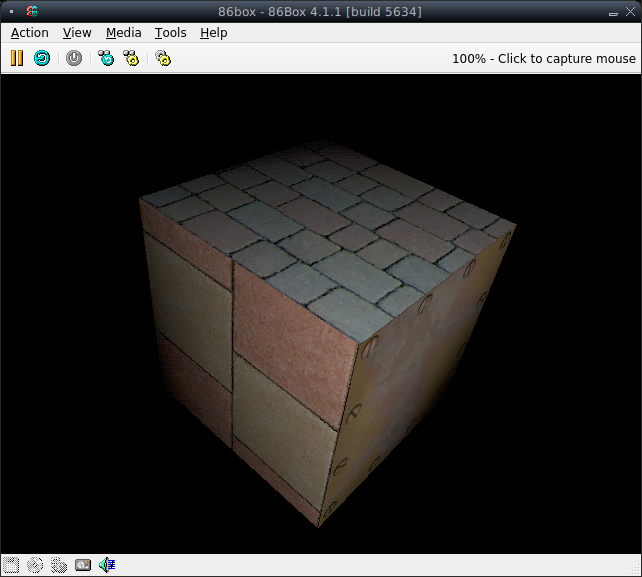
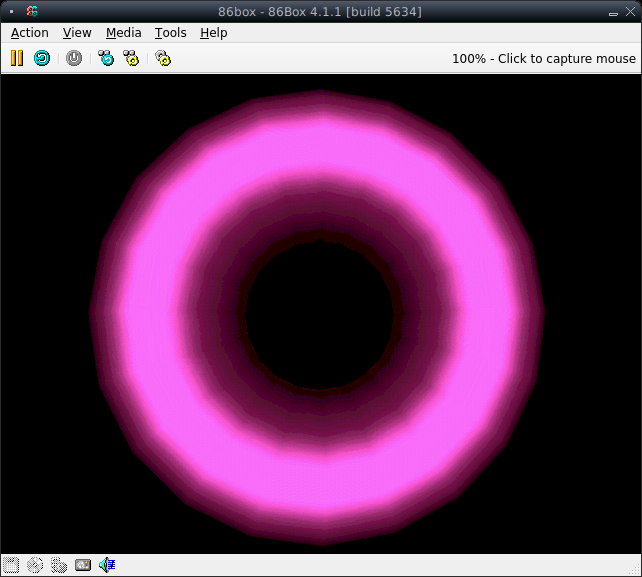

# Glide demo

Spinning 3D objects using the 3Dfx Glide library under MS-DOS. 

Inspired by two videos from PCRetroTech ([#1](https://www.youtube.com/watch?v=jjbqfmbs6Q8), 
and [#2](https://www.youtube.com/watch?v=i47tSCI0L2w)). The code is based 
on some recycled code of mine from the early 2000s, and is not optimal. The 
idea is just to put some pixels on the screen.

Apart from being a hobby, this project can be used for testing Voodoo cards 
under MS-DOS, because it fits into one floppy disk.

## Prerequisites

* A PC with a Voodoo card or a PC emulator (DOSBox or 86Box; 86Box is better as it has Voodoo emulation)
* [Open Watcom 1.9 C compiler](https://github.com/open-watcom/open-watcom-1.9/releases/download/ow1.9/open-watcom-c-dos-1.9.exe)
* [3Dfx Software Developer's Kit 1.0](http://falconfly.3dfx.pl/downloads/3dfx_Software_Developer_Kit_v10.rar) from FalconFly archives (in particular: glide2x.lib library and header files)
* [3Dfx reference drivers](https://www.vogonsdrivers.com/index.php?catid=12) (in particular: glide2x.ovl overlay file)
* A [texture pack](https://drive.google.com/file/d/1e9myBNpWHDAlyTtKmfqpKNdgcAeiuVQ_/view?usp=share_link) that I made based on free textures from OpenGameArt.org
* MS-DOS 6.22 (forget if you have DOSBox)

The Watcom compiler suite is already bundled with the DOS/4GW extender.

Download and unpack the 3Dfx developer's kit. Do not install it as we only 
need particular files. Copy the following header files like so:

    Glide/Src/SST1/include/*.h -> glide/include

And the Glide library:

    Glide/Lib/DOS/Stack/glide2x.lib -> glide/lib

Finally, download and unpack the texture pack in the assets/textures directory, 
and run process.sh to generate textures.

The choice of the glide2x.ovl driver depends on the type of the Voodoo board
that you have. A driver for Voodoo will not work with a Voodoo 2 board, and 
will crash the system. Put the OVL file in the same directory as the program 
executable. None of the official drivers seem to work with 86Box's emulated 
hardware, and always make the emulator crash. For 86Box, use the file included 
in the repository.

## Build

Three targets are available:

* 16-bit DOS + software VGA13h rasterizer (use makefile)
* 32-bit DOS/4GW + software VGA13h rasterizer (use makefile.386)
* 32-bit DOS/4GW + 3Dfx Glide 2.2 rasterizer (use makefile.gl)

The software targets exist as fallback and a reference for the Glide target. 
In order to compile any of the targets, simply use, for example:

    C:\GLDDEMO > wmake -f makefile.gl

ATTENTION! For the Glide target, run prepare.bat first, then run wmake. This 
is a workaround for the fact that there are too many command line options for 
the wcc386 compiler.

## Execute

After you have compiled the code and generated the textures, simply use:

    C:\GLDDEMO > cubegl.exe

There are two objects in the demo, a texture mapped cube, and a Phong 
illuminated torus. Switch between them by pressing [space]. Use [escape] to 
quit the demo. 

The software rasterizer uses polygon drawing routines by Mikael Kalms that 
can be found [at this link](https://www.lysator.liu.se/~mikaelk/doc/perspectivetexture).

## Tested platforms & libraries

Emulators:
* DOSBox 0.74-3
* 86Box 4.1.1 (build 5634; config file included)

Physical system:
* [A Pentium II retro build with a Voodoo 2 SLI](https://www.vogons.org/viewtopic.php?p=1244505#p1244505)

Library and overlay files (MD5 checksums):
* glide2x.lib - 9bea7a7aa072576ba4d5c97245b44be6
* glide2x.ovl - 50ea8e8ea6d4921cb9924680b080023f (for Voodoo 1 emulation in 86Box)
* glide2x.ovl - 837e63598cdd0882e57944c505625256 (for Voodoo 2 on physical PC)

Header files (MD5 checksums):
* 3dfx.h - a8bbbab4e4254406434a8a213abd99a2  
* fxdll.h - f6cd9a236299eec36e4a7b952bc35dea
* fxglob.h - 995e85ea578b1df77ce8c68d76de5127
* fxos.h - 29745e9d0e91bbedaf6158827a1f2ffa
* glide.h - d95b73e67624ca3773a05dd07dab7287
* glidesys.h - 6c89a25867b67a2ed3fcdc4811f2fa71
* glideutl.h - 793b4b900ec61652fc85bd22748b57f9
* sst1vid.h - 5e3fa9b0cabdf310f15ac1145221ab2f

## Gallery

